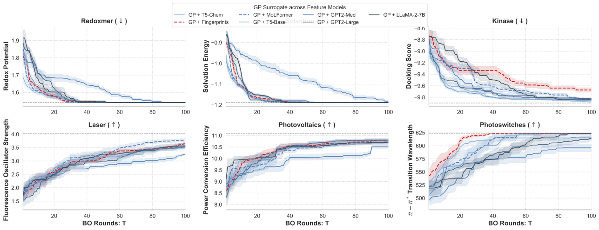
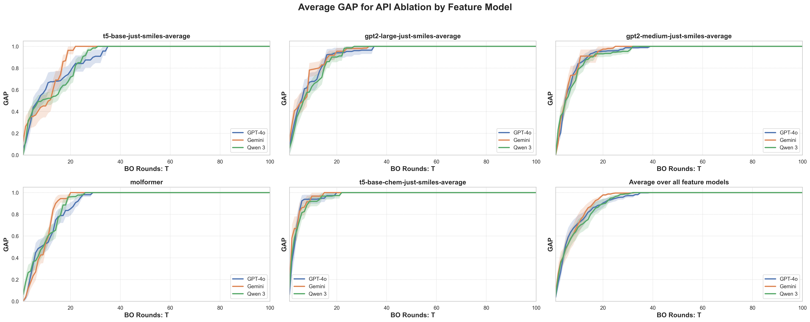
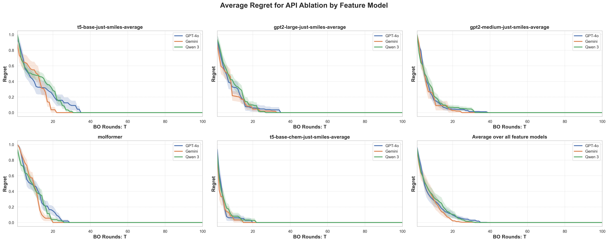

## Data Leakage

Figure 1. This figure compares the performance of Gaussian Process (GP)-based Bayesian Optimization across different models, including LLM-based approaches and non-LLM baselines, under a controlled setting designed to avoid data leakage. The results show that all methods—including those that do not rely on LLM priors or fingerprints—exhibit similar trends, suggesting that the observed performance gains are not driven by memorization or leakage from pretraining data. Instead, the improvements are consistent with the inductive biases introduced by the modeling approach.

